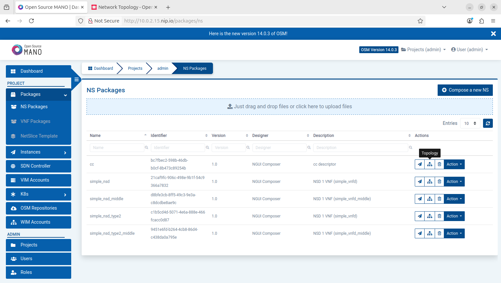

# Network Slicing using OSM

A comprehensive guide to implementing network slicing with Open Source MANO (OSM).

---

## Table of Contents
- [Network Slicing using OSM](#network-slicing-using-osm)
  - [Table of Contents](#table-of-contents)
  - [Introduction](#introduction)
  - [Installing Requirements](#installing-requirements)
    - [Prerequisites](#prerequisites)
    - [Setting up openstack and osm VMs](#setting-up-openstack-and-osm-vms)
      - [Openstack VM Configuration](#openstack-vm-configuration)
      - [OSM VM Configuration](#osm-vm-configuration)
    - [Installing Openstack(using microstack) in Openstack VM](#installing-openstackusing-microstack-in-openstack-vm)
    - [Installing ETSI MANO OSM in OSM VM](#installing-etsi-mano-osm-in-osm-vm)
      - [Cleanup and Fixes](#cleanup-and-fixes)
    - [Connecting Openstack and OSM](#connecting-openstack-and-osm)
  - [Creating Network Slice](#creating-network-slice)
    - [Creating VNFDs, NSDs, and NSTD.](#creating-vnfds-nsds-and-nstd)
    - [Onboarding VNFDs](#onboarding-vnfds)
    - [Onboarding NSDs](#onboarding-nsds)
    - [Onboarding NSTDs](#onboarding-nstds)
    - [Initializing NST](#initializing-nst)
  - [Monitoring](#monitoring)
  - [Viewing Topology from Openstack](#viewing-topology-from-openstack)
  - [Viewing VNF and NS Topology from OSM](#viewing-vnf-and-ns-topology-from-osm)
    - [VNF Topology](#vnf-topology)
    - [NS Topology](#ns-topology)

---

## Introduction

This document provides step-by-step instructions for setting up and managing network slicing using OSM. With OSM, we have used Openstack as VIM. Both OSM and Openstack are initialised in separate VMs initialised through VirtualBox.

---

## Installing Requirements

### Prerequisites

- Oracle VirtualBox Manager.
- Ubuntu 24.04 LTS (noble) iso image file.
- Good amount Hardware Resources.

### Setting up openstack and osm VMs

#### Openstack VM Configuration

- Use Ubuntu 24.04 LTS (noble) iso image file.
- 64GB RAM
- 15 Processors
- 500GB Hard Disk Space
- Set *"Attached to: **Bridged Adapter**"* in **Network** Section under *Adapter 1*

#### OSM VM Configuration

- Use Ubuntu 24.04 LTS (noble) iso image file.
- 64GB RAM
- 20 Processors
- 100GB Hard Disk Space


### Installing Openstack(using microstack) in Openstack VM

In your Openstack VM terminal type the following commands to get Openstack installed.

```bash
sudo apt update && sudo apt upgrade
```

```bash
sudo snap install microstack --beta
```

```bash
sudo microstack init --auto --control
```
*Note: The above step will take a couple of minutes.*

Now save get openstack login password using the following command: 
```bash
sudo snap get microstack config.credentials.keystone-password
```
Save the password.


Now, we will enter into Openstack.

Type in terminal:

```bash
ip a
```

Get your machines host ip from this.

Type that into any web browser's url field and press enter.

This will redirect you to the login page of Openstack.

```
Username: admin
Password: <That you copied in the above steps>
```
Reference link: 
https://snapcraft.io/install/microstack/ubuntu
https://discourse.ubuntu.com/t/get-started-with-microstack/13998
https://www.youtube.com/watch?v=r3E_TGIpQuY

Now, that you have logged in into Openstack you can change the login password according to your needs.

In this example Credentials are changed into:
```
Username: admin
Password: admin
```
for easier access.


### Installing ETSI MANO OSM in OSM VM

In your OSM VM terminal type the following commands to get OSM installed.

```bash
sudo apt update && sudo apt upgrade
```

*<u>*Imp Note:*</u> Before beginning below steps make sure you have **stable internet connection and power supply**. Since, an uninterrupted installation is necessary otherwise you have to manully clean up the parts that have been installed if you restart the installation. See "Cleanup and Fixes" section below.*

```bash
wget https://osm-download.etsi.org/ftp/osm-17.0-seventeen/install_osm.sh
chmod +x install_osm.sh
./install_osm.sh
```

Reference: https://osm.etsi.org/docs/user-guide/v17/01-quickstart.html#installing-osm

Now if the installation has proceeded without any interruption. We can login into osm.

Get your machine's IP using:

```bash
ip a
```

Enter the IP into your web browser url section and press enter.

*Note: In some cases you need to go to https://\<IP\>.nip.io/*

The login credentials are:
```
Username: admin
Password: admin
```


#### Cleanup and Fixes

If you are here that means something went wrong.

**Best way is to delete the current OSM VM and create a new one. Then again follow the OSM installation steps mentioned above.**

**Other removal fixes:**
- Remove osm-devops:
    - ```bash
        sudo apt purge osm-devops
        sudo apt autoremove
        sudo apt update && sudo apt upgrade.

- Remove kubectl:
    - ```bash
        sudo apt-get purge kubectl
        sudo apt-get autoremove

- Remove kubectl policybindings amd tenants:
    - ```bash
        kubectl delete customerresourcedefinition policybindings.sts.min.io
        kubectl delete customerresourcedefinition tenants.minio.min.io

### Connecting Openstack and OSM

* Login to your Openstack from OSM VM.
  *Note: Since the Openstack VM is in "bridged connection" with host as we have setup the Openstack VM this way. We can access Openstack directly in OSM VM.*
  *Note: It is important that Openstack interface is accessible in OSM VM.*
* There head over to **API Access** section and copy the **identity url** under **Service Endpoint.**
* Now login to OSM interface and go to **VIM Accounts** section and click on **New VIM** button.
* Now enter details in the fields as:
  * Name: ```Openstack```
  * VIM project/ Tenant Name: ```admin```
  * Type: ```Openstack```
  * VIM Url: ```\<identity url\>``` that you have copied in above steps.
  * VIM Username: ```admin``` (Your Openstack interface login Username) 
  * VIM Password: ```admin``` (Your Openstack interface login Password) 
  * In the Config Section type:
    ```yaml
    dataplane_physical_net: 'OpenstackPhysicalNetwork,'
    insecure: true
* Finally click on **Create**.

This will add Openstack as VIM Account in OSM.


---

## Creating Network Slice

In this example, I have implemented the 7th hackfest network slicing work.

### Creating VNFDs, NSDs, and NSTD.

Since the vnfds, nsds and nstds provided in the above hackfest were using the old yaml information model, I have converted them into the format ETSI SOL006 that the current OSM accepts.

* ```yaml
  vnfd: Virtual Network Function Descriptor
  nsd: Network Service Descriptor
  nstd: Network Service Template Descriptor
* All vnfds, nsds, and nstd used are provided in the repo.
  * vnfd: ```vnfd.yaml, middle_vnfd.yaml```
  * nsd: ```nsd.yaml, middle_nsd.yaml```
  * nstd: ```nstd.yaml```


Reference of Information Model:
https://osm.etsi.org/docs/user-guide/v17/12-osm-im.html

### Onboarding VNFDs

* Goto **Packages->VNF packages** in OSM interface. 
* Use **vnfd.yaml** file provided in the repo to create a vnfd.
  * You can create a \*.tar.gz file that you can directly drop in the *drag and drop* section.
  * Or
  * You can create a VNF using **Compose a new VNF**, click on this button, enter any name and click create.
  * Now goto "Edit" section of this VNF by either clicking on the **pencil** icon if you are in topology section or if you are in VNF Packages section, goto your VNF, in that use **Actions->Edit**
  * Copy and paste the contents of vnfd.yaml into the Edit section and click **Update and Show Graph**
* Repeat the same process to create another vnfd from **middle_vnfd.yaml**

### Onboarding NSDs

* Goto **Packages->NS packages** in OSM interface.
* Use **nsd.yaml** file provided in the repo to create a nsd.
  * You can create a \*.tar.gz file that you can directly drop in the *drag and drop* section.
  * Or
  * You can create a NS using **Compose a new NS**, click on this button, enter any name and click create.
  * Now goto "Edit" section of this NS by either clicking on the **pencil** icon if you are in topology section or if you are in NS Packages section, goto your NS, in that use **Actions->Edit**
  * Copy and paste the contents of vnfd.yaml into the Edit section and click **Update and Show Graph**
* Repeat the same process to create another nsd from **middle_nsd.yaml**

### Onboarding NSTDs

* Goto **Packages->NetSlice** Template in OSM interface.
* Use **nstd.yaml** file provided in the repo to create a nstd.
  * You can directly drop in this yaml file in *drag and drop* section.


### Initializing NST

* Goto **Instancs->NetSlice Instances** 
* Click on **Create NSI**
* Enter the following details:
  * Name: \<Any name of your choice\>
  * Description: \<Description\>
  * Nst Id: ```simple_nstd1``` (Select the NST from drop-down menu)
  * VIM Account: ```Openstack```


This will create the network.

## Monitoring

We can use *graphana* that is already installed along with osm.

Access graphana dashboard at:

```<osm login URL IP>:3000```

Creadentials are same as that of OSM login.


## Viewing Topology from Openstack

To view the whole network topology:

* Goto **Project->Network** in Openstack
* Choose **Network Topology**
* You can view both Topology and Graph.


**Note: Need to implement network in type2 folder(given in repo) to see the same graph structure**

## Viewing VNF and NS Topology from OSM

You can view the topology of any VNF and NS by going click on the topology icon present beside each VNF and NS onboarded in the **Packages** section

### VNF Topology

Goto **Packages->VNF Packages** and click on topology icon of the VNF you want to see.


### NS Topology

Goto **Packages->NS Packages** and click on topology icon of the NS you want to see.



